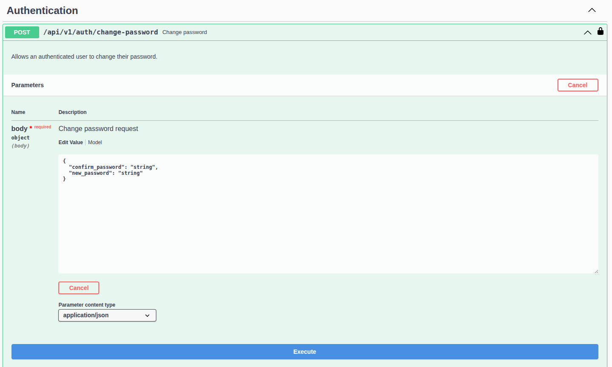

# Pandora Core

**Pandora Core** is the central backend of the Open Source Pandora project, designed for efficient and secure management of API Keys for services. Its primary purpose is to validate, log, and control the consumption of requests made through these API Keys, providing an organized and straightforward management of clients, projects, services, and environments.

It uses PostgreSQL as its persistent storage system, ensuring data consistency and convenient access to logged information.

Thanks to its architecture and clean design, **Pandora Core** offers an efficient and scalable solution, ideal for securely managing controlled access to multiple APIs or services.

## :thought_balloon: Use Cases

**Pandora Core** provides centralized API Key generation, validation, and quota management for client projects and environments. It addresses the need to secure and monitor access to your services—particularly microservices and AI agents—by enabling fine-grained control over usage and simplifying authentication workflows.

* **Quickly onboard new customers** to your agents and LLM-based microservices by issuing API keys and applying specific usage limits for each of your customers' environments.

* **Centralize authentication** to all your services, with quota enforcement through generated API keys.
 
* **Monitor consumption** of your services in real time to optimize billing and adapt pricing models.

## :computer: Upcoming Features

* **Admin UI (Beta)**
  A web-based dashboard for managing resources (clients, projects, environments, API keys).
  It will be available in the coming weeks in beta. The UI will allow you to:

  * Visualize active API keys.
  * Configure quotas.
  * Manage clients, projects, environments and revoke/regenerate keys without using the REST API directly.

* **Python SDK (Beta)**
  A Python package to simplify integration with **Pandora Core**. Key features include:

  * **FastAPI integration** for seamless authentication and authorization out of the box.
  * **Automatic request** logging and quota enforcement at the service level.
  * **Utility functions** for client, project, service, environment, and API Key management.
  * **Quick setup** install via `pip install pandora-sdk`.

## :rocket: Quick Start Guide

This guide assumes you have already deployed the container and want to begin interacting with the API.

### 1. Accessing API Documentation and gRPC Server

* **RESTful API (Swagger UI)**
  Once **Pandora Core** is running, open your browser and navigate to:

  ```
  http://localhost/swagger/index.html
  ```

  You will see the automatically generated Swagger documentation for all REST endpoints.

* **gRPC Server**
  By default, **Pandora Core** exposes its gRPC endpoints on port **50051**.
  To generate client stubs and message types, refer to the `.proto` files available in the [pandora-proto](https://github.com/PandoraSuite/pandora-proto) repository.

### 2. Authentication and Initial Login

When the container starts for the first time, **Pandora Core** generates a temporary admin user and password. The terminal output will display something like:

```bash
[INFO] Default admin credentials:
        - Username: Admin
        - Password: AT0S3WAHXx5kqMZ8
```

> **Note**: The password is randomly generated when the container creation. If you stop and start the container without removing its data directory, the same credentials will persist. The data path is defined by the `PANDORA_DIR` environment variable.

#### 2.1 Change Temporary Password

On your first login to any protected REST endpoint (e.g., GET `/api/v1/services`), you must change the temporary password. You cannot reuse the same password.

<details>
<summary>Example: Change Password Endpoint</summary>

* **Endpoint:** `POST /api/v1/auth/change-password`
* **Request Body (JSON):**

  ```json
    {
      "confirm_password": "string",
      "new_password": "string"
    }
  ```
* **Response:** HTTP 204 OK if successful.



</details>

### 3. Creating Resources via REST API

Follow this typical sequence to configure **Pandora Core**:

1. **Register Service(s) to be Secured**

   * **Endpoint:** `POST /api/v1/services`
   * **Body:**
      ```json
        {
          "name": "string",
          "version": "string"
        }
      ```

2. **Create a Client**

   * **Endpoint:** `POST /api/v1/clients`
   * **Body:**
      ```json
        {
          "email": "string",
          "name": "string",
          "type": "developer"
        }
      ```

3. **Create a Project**

   * **Endpoint:** `POST /api/v1/projects`
   * **Body:**
      ```json
        {
          "client_id": 0,
          "name": "string",
          "services": [
            {
              "id": 0,
              "max_requests": 0,
              "reset_frequency": "daily"
            }
          ]
        }
      ```

4. **Create Environment**

   * **Endpoint:** `POST /api/v1/environments`
   * **Body:**
     ```json
      {
        "name": "string",
        "project_id": 0,
        "services": [
          {
            "id": 0,
            "max_requests": 0
          }
        ]
      }
     ```
   * *Note:* Only services already assigned to the parent project can be assigned to its environments.

5. **Assign Service to a Project**

   * **Endpoint:** `POST /api/v1/projects/{id}/services`
   * **Body:**
     ```json
      {
        "id": 0,
        "max_requests": 0,
        "reset_frequency": "daily"
      }
     ```

6. **Assign Service to an Environment**

   * **Endpoint:** `POST /api/v1/environments/{id}/services`
   * **Body:**

     ```json
      {
        "id": 0,
        "max_requests": 0
      }
     ```
   * *Note:* Only services already assigned to the parent project can be assigned to its environments.

7. **Generate API Key**

   * **Endpoint:** `POST /api/v1/api-keys`
   * **Body:**
     ```json
      {
        "environment_id": 0,
        "expires_at": "string"
      }
     ```

> :warning: **NOTE**: The field `max_requests = -1` in any context indicates unlimited requests.

### 4. Using gRPC Methods

**Pandora Core’s** gRPC interface provides three primary methods:

1. **Validate API Key**: Validates the given API Key and returns client, project and environment details, also logs the request.

2. **Validate API Key and Consume Quota**: Validates the API Key, decrements the quota counter for the associated environment and returns client, project and environment details, also logs the request.

3. **Update Request Status**: Update the status of a previously logged request after processing by the service.

For detailed method signatures and message definitions, consult the `.proto` files in [pandora-proto](https://github.com/your_org/pandora-proto).

## :package: Deployment

> :warning: **Beta Release**: This Docker image is currently in beta. Feel free to try it out and share your feedback with the community.

1. **Pull the Docker image**

   ```bash
   docker pull madpydev/pandora-core:v0.1.0-beta.1
   ```

2. **Run the container**

   ```bash
   docker run -d \
     --name pandora-core \
     -p 80:80 \
     -p 50051:50051 \
     -e PANDORA_DB_PASSWORD="<postgresql_password>" \
     madpydev/pandora-core:v0.1.0-beta.1
   ```

   **Pandora Core** will start and expose ports **80** (HTTP) and **50051** (gRPC).

   > :rocket: **Tip:** To customize Pandora even further, check out the [Pandora Environment Variables](#gear-pandora-environment-variables) section below!

### :gear: Pandora Environment Variables

* **`PANDORA_DB_PASSWORD`** (required) Set the password for the Pandora database. There is no default—this variable **must** be provided.

* **`PANDORA_DB_NAME`** (optional) Rename the database.
  * Default: `pandora`

* **`PANDORA_DB_USER`** (optional) Change the database username.
  * Default: `pandora`

* **`PANDORA_DIR`** (optional) Specify a custom directory for storing Pandora’s configuration and secrets.
  * Default: `/etc/pandora`

* **`PANDORA_JWT_SECRET`** (optional) Provide a fixed secret key for signing JWT authentication tokens. If omitted, Pandora generates a random one at startup (not recommended for consistent development).
  * Default: (randomly generated on each startup)

* **`PANDORA_HTTP_PORT`** (optional) Change the HTTP server’s listening port.
  * Default: `80`

* **`PANDORA_GRPC_PORT`** (optional) Change the gRPC server’s listening port.
  * Default: `50051`

* **`PANDORA_EXPOSE_VERSION`** (optional) Control whether Pandora reveals its version in HTTP responses.
  * Default: `true`

## :rocket: Developer Setup

Ready to dive in? For a full guide on setting up your development environment, running the project, and debugging:

:point_right: See our comprehensive [DEVELOPMENT.md](./DEVELOPMENT.md) guide.

## :compass: Project Status

**Pandora Core** is under active development.

We're continuously working to enhance its capabilities.

## :handshake: Contributing

We welcome community contributions! Your ideas and efforts are highly valued.

Please read [CONTRIBUTING.md](./CONTRIBUTING.md) to learn how to open issues, submit pull requests, and participate in the development process.

## :shield: Security

Found a security vulnerability? We take security seriously.

Please report it privately by following our disclosure guidelines in [SECURITY.md](./SECURITY.md). Do not open a public GitHub issue or pull request for security concerns.

## License

This project is licensed under the terms of the MIT license.
