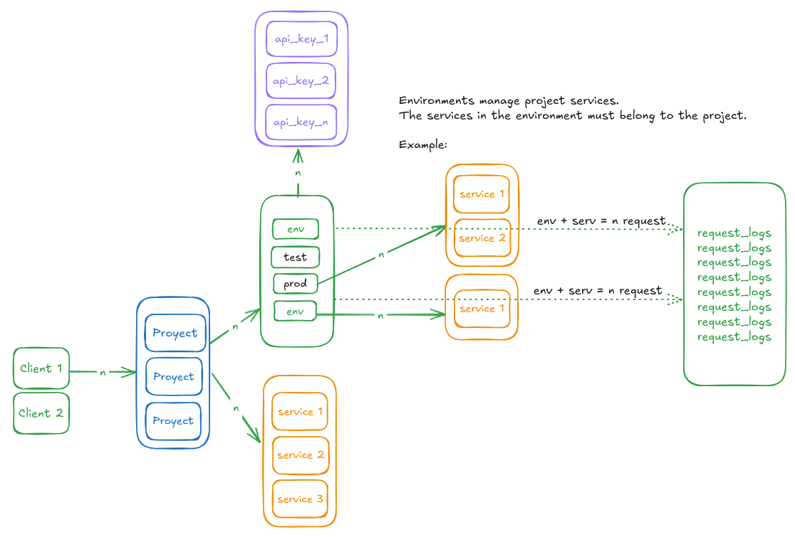

# Pandora

The pandora database manages multiple projects of clients, each project contains services and environments, an environment manages the project services to allow access through API Key, for each service within the environment the received requests are stored and also a policy of control of available requests through reservations.

# Description

# General

:sparkles: The entities service, client, project, environment, api_key, project_service, and environment_service implement triggers in postgresql to keep the updated_at field updated in updates of their records.

:sparkles: The project_service and environment_service entities are intermediate tables that require a composite primary key to identify the record and also all services assigned to an environment must belong to the project.

:sparkles: An environment can have multiple API Key and this field implements an index in postgresql to optimize queries.

:sparkles: Pandora should not expose the name field of the environment entity for updates because its focus is to define access keys for the different environments of a project and the recommendation is to maintain the use of the appropriate keys.

:sparkles: The entity request_logs stores all the requests received for authentication with API Key for a service in a certain environment of a project, and in those cases in which the flow of a process requires the consumption of more than one endpoint, pandora stores in the start_point field a reference to the same entity for the initial record of the flow, which allows from this entity to find the set of consumptions for a process.
This entity also implements postgresql indexes for the api_key and start_point fields, regarding its id field it is of text type and it will be auto generated.

:sparkles: The reservations entity allows to persist the reservations of flows that require more than one endpoint to be completed, and to decrease the amount of the available_request field depending on the successful state of a process, allowing high concurrency. The records of this entity are created once the flow is started and deleted when the flow has been completed and the available_request field has been discounted. The id field will be of type autogenerated text.
